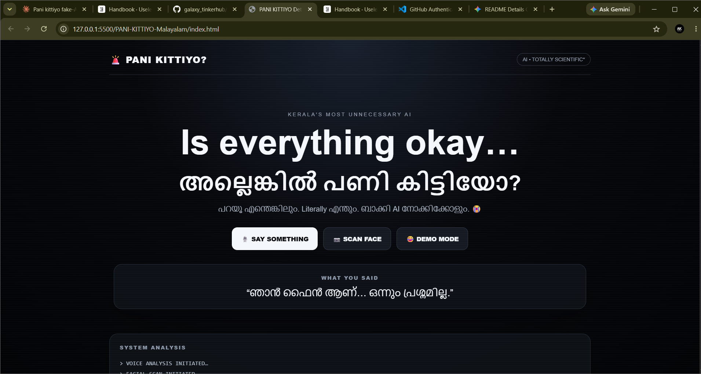
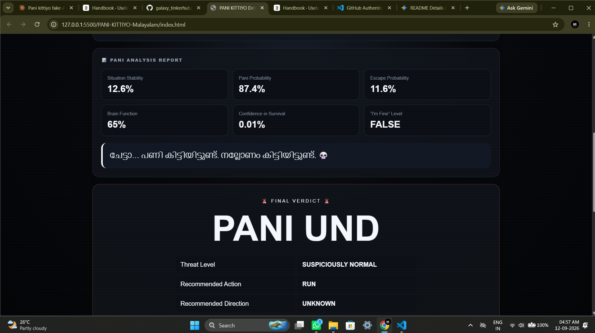
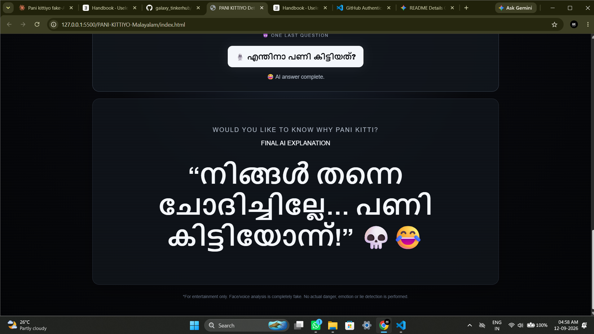

# PANI KITTIYO? Detector 🎯

## Basic Details
### Team Name: Galaxy

### Team Members
- Team Lead:  - Aaron Kleny 
- Member 2: Agna Mariya Joseph - Sahrdaya College of Engineering and Technology

### Project Description
PANI KITTIYO? Detector is a comedic fake-AI web app that "scans" your face and voice — with zero real science — and delivers a dramatic verdict on exactly how much trouble ("pani") you're in, spoken aloud in Malayalam for maximum regional sting.

### The Problem (that doesn't exist)
You genuinely cannot tell if you're "in trouble" (pani kittiyo?) just by vibes. There's no tool that consults 47 imaginary experts, scans your face for zero seconds of real analysis, and gives you a definitive, screen-shaking verdict when you need one most.

### The Solution (that nobody asked for)
We built a browser app that pretends to listen to your voice and look at your face, then lets Math.random() decide your fate. A fake progress bar with dramatic log lines builds suspense, a high "doom score" makes the whole screen shake, and the final verdict is read aloud in Malayalam via text-to-speech — no backend, no ML model, just unearned confidence.

## Technical Details
### Technologies/Components Used
For Software:
- Languages: HTML5, CSS3, JavaScript (ES6+)
- Frameworks: None
- Libraries: None — pure vanilla JS, no build tools
- Browser Web APIs: SpeechSynthesis, SpeechRecognition (ml-IN Malayalam), MediaDevices (getUserMedia for the fake camera scan), Web Animations API (screen-shake effect)
- Tools: VS Code + Live Server extension

### Implementation
For Software:

# Installation
No installation needed — there's no Node.js or Python dependency. Just open the project folder in VS Code.

# Run
Open `index.html` with the Live Server extension (or double-click `index.html` to open it directly in a browser). Allow microphone and camera permissions when prompted for the full comedic effect.

### Project Documentation
For Software:

# Screenshots (Add at least 3)

*The landing page with the main interface to start the "pani" detection*


*The app performing its dramatic fake analysis with progress indicators*


*The final verdict screen with the doom score and Malayalam verdict*

# Diagrams
    A[User Opens App] --> B[Landing Page]
    B --> C[Request Microphone & Camera Permissions]
    C --> D[User Grants Permissions]
    D --> E[Start Analysis Button]
    E --> F[Fake Scanning Process]
    F --> G[Progress Bar with Dramatic Logs]
    G --> H[Generate Random Doom Score]
    H --> I[Create Malayalam Verdict]
    I --> J[Display Result Screen]
    J --> K[Screen Shake Effect]
    K --> L[Text-to-Speech Malayalam Verdict]
    L --> M[User Gets Final Verdict]
```
*The workflow shows how the app takes user input through browser APIs, performs fake analysis with dramatic UI effects, and delivers a humorous random verdict*

### Project Demo
# Video
[PANI KITTIYO? Detector Demo](https://drive.google.com/file/d/1IDm4P1mFMiFZEJYI-iIXSd1JohW8xvjH/view?usp=drive_link)
*Watch the complete demo showing the landing page, fake analysis process with dramatic progress indicators, and the final Malayalam verdict with screen-shake effect*

# Additional Demos
[Add any extra demo materials/links]

## Team Contributions
- Aaron Kleny
- Agna Mariya Joseph

---
Made with ❤️ at TinkerHub Useless Projects


